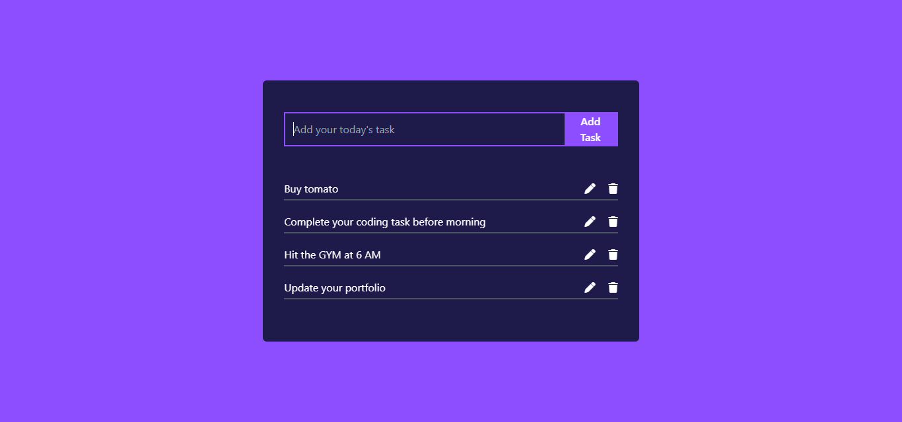

# To Do List App

This is an basic React todo website made using reactJS to demonstarte my learning. It has usable function such as add a task, delete a task and edit the previous task. This is an user friendly design supporting responsive layout

## Features

1. **Add Task**: this application allows users to add thier task efficiently.
2. **Edit Task**: It allows users to edit their previous task.
3. **Delete Task**: It allows users to delete the task they have completed.
4. **Responsive layout**: This applicaton is user friendly and supports all the devices

## Contributions

Contributions are what make the open-source community such an amazing place to learn, inspire, and create. Any contributions you make are **greatly appreciated**.

1. Fork the project.
2. Create your feature branch (`git checkout -b feature/AmazingFeature`).
3. Commit your changes (`git commit -m 'Add some AmazingFeature'`).
4. Push to the branch (`git push origin feature/AmazingFeature`).
5. Open a pull request.

Please make sure to update tests as appropriate and adhere to the [Code of Conduct](CODE_OF_CONDUCT.md).

### Code Style

When contributing to this repository, please follow the [style guidelines](CONTRIBUTING.md) provided.

### Issues and Bugs

If you encounter any issues or bugs, please [open an issue](../../issues) in the repository.

### Feature Requests

Have a feature request? Please [open an issue](../../issues) and provide as much detail as possible.

### Pull Requests

Pull requests are welcome. For major changes, please open an issue first to discuss what you would like to change.

### License

By contributing, you agree that your contributions will be licensed under the project's [License](LICENSE).

## Author
-[Rohan Basnet](https://rohanbasnet12.github.io/Modern-portfolio/)
-[Redirect](https://rohanbasnet12.github.io/To-do-list/)
